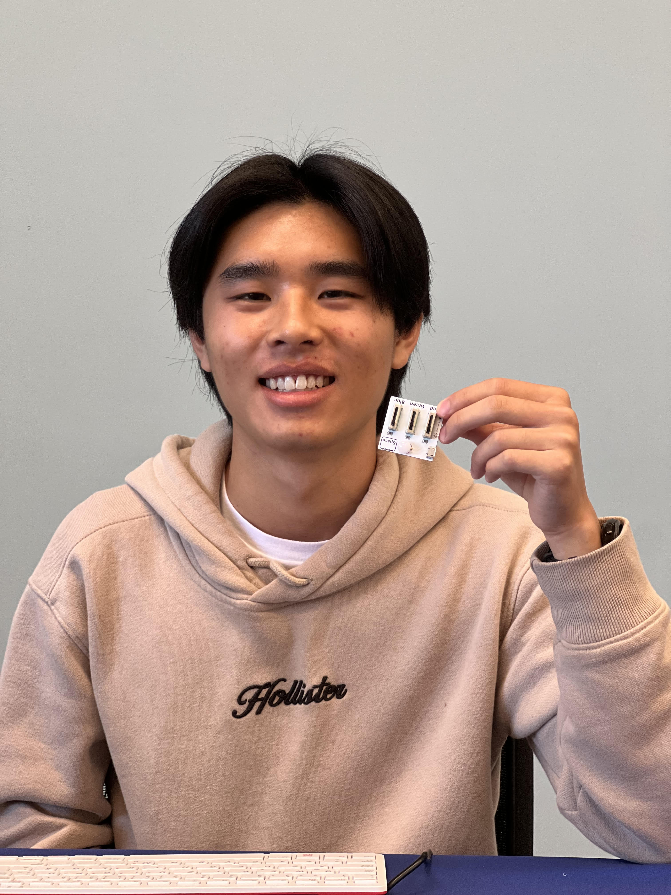

# Smart Mirror

The smart mirror is a customizable mirror run off the Raspberry Pi OS. Using Node.js, the mirror displays different modules that display different types of information, such as the weather or recent news updates. The modules are completely customizable and can be coded to display databases from Notion or Google sheets, for example.

| **Engineer** | **School** | **Area of Interest** | **Grade** |
|:--:|:--:|:--:|:--:|
| Alex W | Mountain View High School | Electrical Engineering | Incoming Senior

  
# Final Milestone
<iframe width="560" height="315" src="https://www.youtube.com/embed/K_CM9QeQhP4" title="YouTube video player" frameborder="0" allow="accelerometer; autoplay; clipboard-write; encrypted-media; gyroscope; picture-in-picture; web-share" allowfullscreen></iframe>

I am done! The mirror is mounted onto the frame that I've built and can now be mounted to a surface so that it actually functions as a mirror. The arm the mirror is attached to can swivel and the hand itself (the part that's attached to the display itself) can rotate. Now, all that's left to do is choose a spot at my house and mount it. 

### Components
1. 18 in by 24 in mirror frame: holds the display and plywood
2. Plywood: prevents the display from shifting side to side
3. Monitor: displays the modules
4. Raspberry Pi 400: computer the display runs off of 
5. LED Strips: light up the mirror and look good
6. 18 in by 24 in 2-way mirror: mirror
7. Nylon webbing: secures the display; prevents it from moving back and forth
8. Grommets + Eyelet tool: used to help drill nails through the nylon webbing 

### Progress/Finishing the Mirror 
To finish the mirror, I
1. Measured and cut plywood to fit dimensions of the mirror frame I am using (18 in x 24 in); this is used to prevent the display from shifting side to side, since hte monitor is not large enough to fit securely in the actual mirror frame.
2. I cut a second hole in the middle of the plywood just large enough to fit the monitor so that the display can sit comfortably inside
3. Painted the plywood black so that it matches the mirror frame and absorbs any excess light
4. Cut divots down the plywood on the front and on either side of the hole in the middle so that the divots frame the area where the mirror will sit
5. Drilled holes into the ends of those divots (the holes were drilled on the same side of the mirror) where I could later feed wire through 
6. Cut and glued LED strips into the divots then sautered wires to the pads of the LED to attach to a single wire so that I could power both strips with a single plug
7. Fed the wires through the two holes I cut earlier 
8. Set the frame in hte mirror frame and drilled pilot holes throuhg both the frame and the plywood through the sides of the frame
9. Used nails and drilled through the pilot holes to seure the plywood to the mirror frame
10. Attached a wall mount plate to the back of the monitor display and fed nylon webbing through extra holes in it
11. Secured the nylon strips to the plywood by punching grommets into the webbing using an eyelet tool and drilling nails through the grommets
12. Attached the mounting arm to the mounting plate
13. Hooked a power strip up to the back of the display by drilling two nails into the plywood and inserting the nails into the holes on the back of the strip
14. Plug in all the wires

### Challenges
I ran into several challenges as I completed the mirror. The worst one was when I was securing the plywood to the mirror frame by drilling nails into the sides, I accidentally drilled too low, so I ended up cracking and warping the mirror. There isn't much I can do about that, so I'll have to order another mirror and re-install it. Another major challenge I ran into was when I was putting the display back into the plywood frame, the wood had warped, so the display no longer fit. I spent a significant amount of time filing the wood down to size so that the display fit. 

### Next Steps
Not much else to do other than mount it on my wall and use it!

# Second Milestone
<iframe width="560" height="315" src="https://www.youtube.com/embed/a3SVgaacQEY" title="YouTube video player" frameborder="0" allow="accelerometer; autoplay; clipboard-write; encrypted-media; gyroscope; picture-in-picture; web-share" allowfullscreen></iframe>

For this milestone, I've customized the display of the mirror. On download, the mirro comes with a couple of default modules (see milestone one). I added 3 new modules: 3-day weather updates, Spotify 'now playing', and a Notion database display. The modules were created through 3rd party code [here](https://github.com/MichMich/MagicMirror/wiki/3rd-party-modules). Each one has detailed and specific instructions on the integration process. 

### Components
1. 3rd party modules found on github
2. config.js: essentially the framework of the mirror; actually file that is run, accesses other files by calling their classes; contains the modules array where required module information is stored
3. modules folder: downloaded during Magic Mirror installation (see milestone 1); 3rd-party modules from github are downloaded here and can be called in config.js
4. JavaScript: coding language used
5. JSON: used to store and transport information
6. custom.css: used to customize individual modules; can be used to custome position and size, along with more specific aspects such as the font, although I didn't use that feature 
7. other dependency folders: generally untouched unless debugging; almost always the same across modules

### Progress/Customizing Display
As of the second milestone, I have:
1. added 3 3rd-party modules
2. 3-Day Weather Forecast: displays weather forecast for today, tomorrow, and day after
  → github link found [here](https://github.com/nigel-daniels/MMM-3Day-Forecast)
3. Spotify On-Play: displays current song playing (if any at all), along with relevant information about the song, such as the title and progress through the song
  → github link found [here](https://github.com/Fabrizz/MMM-OnSpotify)
4. Notion Database: displays information from a Notion database, which is highly customizable. In my case, it displays my To-Do's database by ascending date and shows the due date.
  → github link found [here](https://github.com/choffmann/MMM-Notion)
5. Edited the size and location of different modules using custom.css
6. Customized messages in the 'compliments' module (default) by navigating to compliments.js and changing the Strings in the compliments array

### Challenges
I ran into several challenges while I progressed to milestone 2. Each module came with its own challenges, although the Notion module gave me the most trouble. For the 3-Day Weather Forecast module, I had to use an API key from [OpenWeatherMap](https://openweathermap.org/). However, even upon copying the API key into relevant module in config.js, the module wasn't displaying an information. After some troubleshooting, I realized that I also had to copy the API key into the 'MMM-3Day-Forecast.js' file as well. 

For the Spotify now playing module, I had to create a Spotify App in developer mode. The app connects to the mirror display using a localhost server, but when I initially ran the display, nothing was showing up for Spotify. For some reason, the localhost server wasn't accessible. I tested by searching the IP address 127.0.0.1, along with the server's web url itself, but both tests revealed that while the server was up and running, it was inaccessible. It was only after completely deleting the Spotify App and creating a new one that the server became accessible. 

As I mentioned above, the Notion module gave me the most trouble. At first, the module wouldn't even run because I had not downloaded a Notion library called @notionhq/client. However, even after downloading the library, the module refused to load and crashed the display every time I attempted to open it. The reason the module was failing was because of the filter type it was sorting by. The Notion to-do database uses a variety of different properties to filter, such as status and date. Properties are separated into two categories: Strings and objects. In the default code, the module was filtering a String property, but in my database, I was using an object filter. After researching, I found [Notion documentation](https://developers.notion.com/reference/post-database-query-filter) that explained how to filter by an object property, as well as how to filter multiple properties.  

### Next Steps
My next step is to build the mirror itself. I have the display completely customized, but now I need to turn the display into an actual mirror. I'll be using an 18x24 mirror frame, a 2-way mirror sheet, and plywood to hold the monitor display. I'm also going to glue LED strips on the sides of the mirror to give it more ambience and a classier look. 

# First Milestone
<iframe width="560" height="315" src="https://www.youtube.com/embed/vfy8MCB6NEs" title="YouTube video player" frameborder="0" allow="accelerometer; autoplay; clipboard-write; encrypted-media; gyroscope; picture-in-picture; web-share" allowfullscreen></iframe>

I'm currently building the smart mirror, which is a mirror that can display real-time and customizable information. It has several default modules, such as compliments, real-time news updates, and the time. Through Github, I'm able to add a few modules of my own or even code them once I learn how. 

### Components
1. Raspberry Pi 400 Keyboard: used as the brains of the monitor; contains the operating system, power supply, and code to run the display; also used to type on the monitor
2. Monitor: connected to the keyboard; displays the mirror itself
3. Mouse: connected to the keyboard; used to navigate the monitor since the keyboard has no integrated mouse pad
4. Node.js: JavaScript runtime environment used to download code from Github and run it; display runs off of Node

### Progress/Setting Up Display
As of the first milestone, I have
1. Flashed the Pi imager onto an SD card using [Raspberry Pi's imager software](https://www.raspberrypi.com/software/)
2. Inserted the SD card into the Raspberry Pi 400 keyboard and connected the keyboard to the monitor and a powersource
  → I used USB C as a powersource for the keyboard and a micro-HDMI to HDMI cable to connect the keyboard to the monitor 
4. Downloaded Node.js using terminal and the instructions found on the [Magic Mirror website](docs.magicmirror.builders)
5. Navigated to the 'Magic Mirror' directory using the command 'cd Magic Mirror'
6. Run one final 'npm run start' command in the command prompt of the Raspberry Pi to yield the display.

### Challenges
The biggest challenge I faced was actually hooking the Pi up to the monitor. The first Pi I used was faulty and kept getting hot when I plugged it in. I found another Pi, but when I hooked it up to the monitor, the monitor didn't detect an input and fell asleep. I realized this was because the Pi wasn't reading the SD card, for whatever reason, but after testing several Pis, the keyboard finally worked. 

### Next Steps
My plan for the future is the create a wooden frame for the mirror and secure the monitor to the frame using nylon strips. To give the mirror a more aesthetic look, I'm going to attach LEDs to the frame around the monitor. In order to power the LEDs, I'll need to attach a power strip as well. 

# Starter Project
 <iframe width="560" height="315" src="https://www.youtube.com/embed/XVKCBS4upeY" title="YouTube video player" frameborder="0" allow="accelerometer; autoplay; clipboard-write; encrypted-media; gyroscope; picture-in-picture; web-share" allowfullscreen></iframe>

The project consists of an RGB LED, board, and three switches each corresponding to RGB (red, green, blue) values. Sliding the swtches up and down controls the intensity of each color on the LED, which allows the LED to display a gradient of colors. The three switches and LED shown are soldered on the back, and the longest pin of the LED is slotted into the hole with a - sign indicated. 

### Components 
1. Soldering board: holds the project; parts are soldered to the board to keep them in place and create a circuit
2. Common Cathode LED: 4-pin LED that takes in 3 positive inputs and 1 negative output - power flows through the 3 positive pins (flow into those pins is controlled by the slide switches) and out the negative output. As electricity runs through the bulb, it releases light, the color of which depends on the orientation of the switches.
3. Slider switches: switches that slide back and forth; 3 switches connected to the 3 input pins of the LED; sliding a switch up or down controls the amount of red, green, or blue light (RGB) light the LED emits.

### Progress
The LED and switches have been completely soldered to the board and can properly conduct a current, which allows the LED to emit light once connected to a power source. 

### Challenges

I ran into trouble soldering the LED because I didn't push the LED flush with the board before soldering, so it was stuck in a raised position. However, I learned that didn't matter because current could still flow to the LED.

# Code

# Bill of Materials

## Starter Project
1. RGB LED
2. Soldering board
3. 3 switches

## Smart Mirror

# Other Resources/Examples
